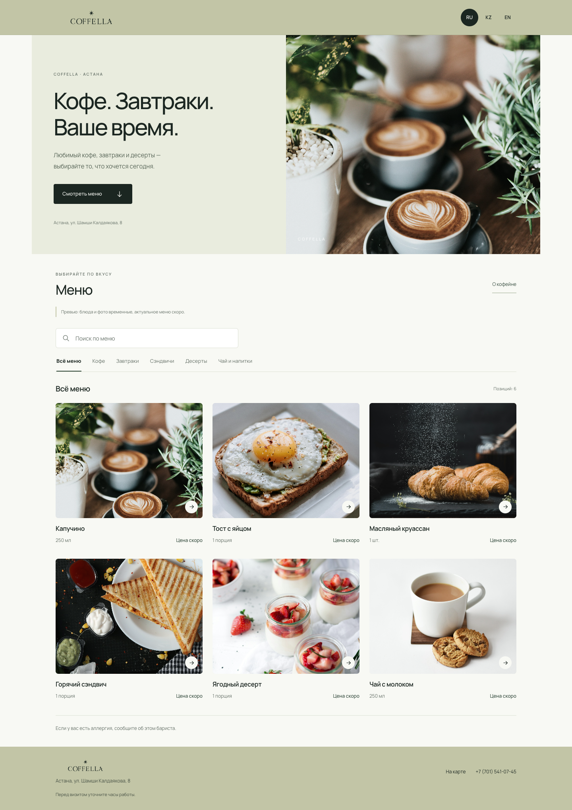
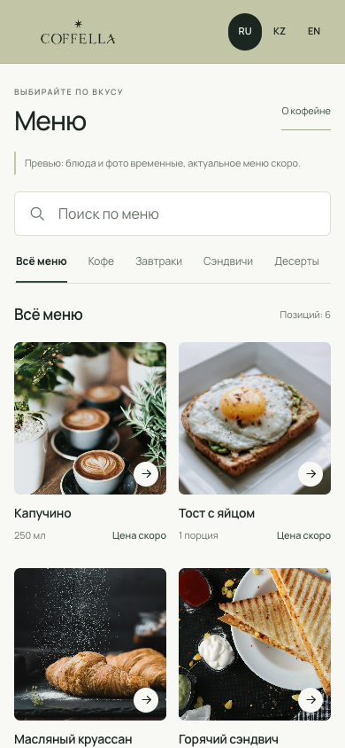

<div align="center">
  
  <h1>Coffella · Digital Menu</h1>
  <p>Цифровое меню кофейни в Астане</p>
  <p>Русский · Қазақша · English</p>
</div>

Адаптивное меню для просмотра по QR-коду в заведении и по ссылке из Instagram. Спокойная оливковая палитра, фотографии блюд и быстрый поиск.

> **Демонстрационная версия.** Блюда, порции и фотографии временные. Актуальное меню и цены будут добавлены после получения материалов от Coffella. Онлайн-заказ и оплата не предусмотрены.

## Превью



<details>
  <summary>Версия для телефона</summary>
  <br>
  
</details>

## Что работает

- Три языка с переводами интерфейса, категорий и блюд; выбор языка сохраняется.
- Поиск по названиям и описаниям на всех трёх языках.
- Фильтры категорий и подробные карточки блюд.
- Закреплённые поиск и категории при прокрутке.
- На телефоне — автоматический переход к меню при открытии; вступление остаётся доступным выше.
- На компьютере — знакомство с кофейней на первом экране.
- Клавиатурная навигация, закрытие карточек через Escape и поддержка уменьшенного движения.

## Локальный запуск

Сайт работает на HTML, CSS и JavaScript без сборки и зависимостей.

```sh
python3 -m http.server 8000
```

Откройте `http://localhost:8000`. Также можно открыть `index.html` напрямую.

## Структура

| Файл | Назначение |
| --- | --- |
| `index.html` | Разметка страницы |
| `style.css` | Палитра, типографика и адаптивная вёрстка |
| `script.js` | Языки, поиск, фильтры и карточки |
| `menu-data.js` | Категории, блюда и их переводы |
| `assets/` | Логотип и локальные фотографии |
| `docs/` | Превью для репозитория |

## Обновление меню

В `menu-data.js` для каждого блюда задаются `id`, `category`, `name`, `description`, `size`, `price` и `image`. Текстовые поля содержат переводы `ru`, `kk`, `en`. Цена указывается числом в тенге; `null` выводит «Цена скоро».

```js
{
  id: 'cappuccino',
  category: 'coffee',
  name: { ru: 'Капучино', kk: 'Капучино', en: 'Cappuccino' },
  description: {
    ru: 'Эспрессо, молоко и молочная пена.',
    kk: 'Эспрессо, сүт және сүт көбігі.',
    en: 'Espresso, milk and milk foam.'
  },
  size: { ru: '250 мл', kk: '250 мл', en: '250 ml' },
  price: null,
  image: 'assets/coffee.jpg'
}
```

После получения материалов: заменить демонстрационные позиции и фото, подтвердить составы и контакты, затем убрать пометки превью в `index.html` и соответствующие переводы в `script.js`.

## Публикация

Подходит для GitHub Pages: ветка `main`, папка `/ (root)`, без сборки. Файл `.nojekyll` отключает обработку Jekyll. После включения Pages постоянную HTTPS-ссылку можно использовать в Instagram и QR-коде.

## Источники материалов

- [Опубликованное меню Coffella](https://coffeecoffella-source.github.io/menucoffella/) — логотип и цвета `#C2C5A6`, `#1B2621`; актуальность сверяется после получения брендбука.
- [Карточка заведения](https://yandex.kz/maps/ru/org/coffella/6292859756/) — адрес и телефон. Часы работы требуют уточнения.
- [Kultúra Diktúet](https://kulturadiktuet.com/) — референс структуры цифрового меню.
- [Unsplash](https://unsplash.com/) — временные фотографии. ID оригиналов: `photo-1509042239860-f550ce710b93`, `photo-1525351484163-7529414344d8`, `photo-1555507036-ab1f4038808a`, `photo-1528735602780-2552fd46c7af`, `photo-1488477181946-6428a0291777`, `photo-1544787219-7f47ccb76574`.
- Manrope через Google Fonts; при отсутствии сети используются системные шрифты.

Логотип и материалы заведения принадлежат их правообладателям.
